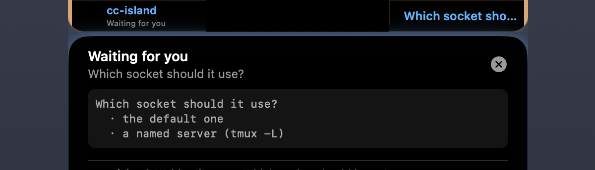
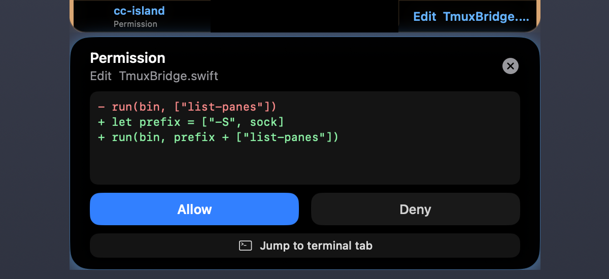

<div align="center">

# CLI Island

**Your MacBook's notch, telling you what your coding agents are doing.**

Claude Code, GitHub Copilot and OpenAI Codex push what they are doing into the notch — and,
the part that matters once you have more than one running, **tell you which session is waiting
for you.**

[](#install)
[](Sources)
[](#install)
[](LICENSE)

English · [繁體中文](README.zh-TW.md)



</div>

---

## What it is for

An agent that has stopped to ask you something costs you every second nobody notices. Measured
across the transcripts on one machine, 58 of those questions were answered at a **median of 71
seconds** and a **maximum of 10.9 hours**. Ten hours is not deliberation. It is nobody knowing
they were being asked.

The rest is the same idea with less at stake: what a session is doing right now, which of your
four is the one that finished, and whether the thing it wants is a permission or an answer.

**It installs one small binary into your agent's hook directory and nothing else** — no daemon
you did not start, no account, no network beyond `127.0.0.1`.

## What it does

### Says when a session is waiting for you


`AskUserQuestion` and `ExitPlanMode` are the tools whose *execution is a person answering*. The
island shows the question and its options, pulses, and **does not dismiss itself** — a marker
that disappears on a timer is worse than none, because the thing it reported has not stopped
being true. Clicking it focuses that session's terminal pane, through tmux where you use it.

It also survives your other sessions: while somebody is being asked, a `Bash` running in another
project cannot bury the question.

### Answers a permission without leaving your editor



When Claude Code wants to run `Bash` or edit a file, the island shows the actual diff and takes
Allow/Deny right there. The hook long-polls for up to five minutes, so you can walk away and
still come back to live buttons; if you never answer, it steps aside and Claude Code prompts you
the way it always would.

### And everything else, briefly

| Event | Left ear | Right ear |
|---|---|---|
| You send a prompt | | thinking glow |
| Read / Grep / Glob | Reading, Searching | file or pattern |
| Edit / Write | Editing | filename, with a diff when expanded |
| Bash | Terminal | the command |
| Subagent activity | `↳ agent_type` | what it is doing |
| A long task | its title | `N/M` and a ring, updated in place |
| Finished | Done | |

Sessions are coloured by source — Claude orange, Copilot purple, Codex green — and by project
name when several of the same source are running. Displays without a notch get a capsule instead,
and the island follows your cursor between screens.

## Install

### From a release

Download `DynamicIsland.zip` from [Releases](https://github.com/bistin/cc-island/releases), unzip,
and drag it to `/Applications`. It is ad-hoc signed, so the first launch needs
**right-click → Open**.

### From source

```bash
git clone https://github.com/bistin/cc-island.git
cd cc-island

# Build (produces both DynamicIsland app and the hook binary)
swift build -c release

# Run unit tests (428 tests: hook payload formatting, HTTP parser, screen resolver, and more)
swift test

# Render the app icon (AppKit only — no design tool needed)
swift scripts/render-app-icon.swift build/AppIcon.iconset
iconutil -c icns build/AppIcon.iconset -o AppIcon.icns

# Assemble .app bundle
mkdir -p DynamicIsland.app/Contents/{MacOS,Resources}
cp .build/release/DynamicIsland DynamicIsland.app/Contents/MacOS/
cp .build/release/island-hook   DynamicIsland.app/Contents/Resources/
cp AppIcon.icns DynamicIsland.app/Contents/Resources/
cp Info.plist DynamicIsland.app/Contents/
codesign --force --deep --sign - DynamicIsland.app

# Launch
open DynamicIsland.app
```

Requires macOS 13 or later and Swift 5.9. There are no third-party dependencies: Foundation,
AppKit, SwiftUI and Network, and nothing else.

## Hooks

### Claude Code

The first launch offers to set them up. **Install** deploys the hook binary to
`~/.claude/hooks/dynamic-island-hook` and registers the events in `~/.claude/settings.json`,
leaving any other tool's hooks alone. Later launches re-sync silently when the app has been
upgraded, and write nothing when it has not.

```bash
DynamicIsland --install-hooks     # install or upgrade
DynamicIsland --uninstall-hooks   # remove
```

Registered events cover the session lifecycle, tool use, permissions and compaction.
`PermissionRequest` is deliberately limited to the tools that can change something —
`Bash|Edit|Write|MultiEdit|NotebookEdit` — so a subagent reading files does not fill your notch
with Allow/Deny.

### GitHub Copilot CLI

Copilot's hooks are per-repository, so install them in each one:

```bash
cd /path/to/your/repo
DynamicIsland --install-copilot-hooks           # defaults to the current directory
DynamicIsland --uninstall-copilot-hooks [path]
```

That writes `{repo}/.github/hooks/hooks.json` and deploys the binary to
`~/.copilot/hooks/dynamic-island-hook`. **The JSON is tracked by git by default** — add it to
`.gitignore` if you would rather not commit it for your team.

### OpenAI Codex

```bash
DynamicIsland --install-codex-hooks
DynamicIsland --uninstall-codex-hooks
```

Deploys to `~/.codex/hooks/dynamic-island-hook` and writes `~/.codex/hooks.json`, migrating the
deprecated `codex_hooks` key in `config.toml` if it is still there. Afterwards run `/hooks` in
Codex to review and trust them — Codex keys trust on a hash of the definition, so it asks again
whenever the content changes.

The registration focuses on shell, file changes and lifecycle rather than every MCP call, so the
notch stays useful.

## Check it works

```bash
curl -s -X POST http://127.0.0.1:9423/event \
  -H "Content-Type: application/json" \
  -d '{"title":"Hello","subtitle":"It works!","style":"success","duration":3}'
```

Both ears should slide out. Settings → Diagnostics has the same thing as buttons, along with a
permission-flow test and the state of every hook install.

## Open at login

Settings → General → Startup, or **Open at Login** in the menu bar. It uses `SMAppService`, so
macOS owns the switch and you can revoke it in System Settings → General → Login Items.

```bash
/Applications/DynamicIsland.app/Contents/MacOS/DynamicIsland --login-item-status
```

`enabled`, `notFound` (the ordinary state before you turn it on), `requiresApproval` (registered,
but switched off in System Settings — only System Settings can undo that), or `unavailable` (you
are running a bare `swift build` binary, which has no bundle to register).

The command is read-only on purpose: registering a login item should take a deliberate click, not
a stray line in a script.

## HTTP API

Anything that can POST can use the island.

```bash
curl -X POST http://127.0.0.1:9423/event \
  -H "Content-Type: application/json" \
  -d '{"title":"Deploy","subtitle":"v1.2.3","style":"success","duration":5}'
```

| Field | Type | Default | Description |
|-------|------|---------|-------------|
| `title` | string | required | Left ear text |
| `subtitle` | string | `""` | Right ear text |
| `style` | string | `"claude"` | `info` / `success` / `warning` / `error` / `claude` / `action` / `reminder` |
| `duration` | number | `4.0` | Display seconds |
| `detail` | string | `null` | Expanded view content; `+ ` / `- ` lines render as a coloured diff |
| `progress` | number | `null` | 0.0–1.0 progress bar / ring |
| `persistent` | bool | `false` | Don't auto-dismiss (`true` for `action` / `reminder`) |
| `tty` | string | `null` | `/dev/ttysNNN`, so a click can focus that terminal tab |

POSTing the same `title` with a new `progress` updates in place rather than re-animating, which is
how a long task streams without flickering.

## When something is wrong

`~/Library/Logs/CLI Island.log` records what the app could not tell you otherwise: whether the
listener bound, whether the hooks were rewritten or already current, and which route a click took.
It holds routes and outcomes only — never what a session asked or what a file contained.

```bash
tail -f ~/Library/Logs/"CLI Island.log"

# Why did clicking jump to the wrong tab?
DynamicIsland --reveal-tty /dev/ttys004 [--tmux-socket /path/to/socket]

# What does this build assume about Claude Code, tmux and macOS?
DynamicIsland --compat-table
```

[`docs/compatibility.md`](docs/compatibility.md) is that last one as a page. **Almost nothing this
app reads is an API** — a transcript layout, a hook firing order, tmux format strings — and every
one of those changing looks like this app being broken. The page lists what each would look like
from the outside.

## Common commands

```bash
open /Applications/DynamicIsland.app                 # launch
pkill DynamicIsland; open /Applications/DynamicIsland.app   # restart
pkill DynamicIsland                                  # quit (or use the menu bar)
DynamicIsland --help                                 # every flag
```

## Architecture

Two pure-logic libraries with no AppKit in them, an app that draws, and a hook binary small enough
to run on every tool call.

```
Sources/
├── DynamicIsland/                  # The app — AppKit + SwiftUI
│   ├── App.swift                       # entry, CLI flags, NSAlert install prompt, menu bar
│   ├── HookInstaller.swift             # installs Claude / Copilot / Codex hooks, syncs on drift
│   ├── CodexHooksConfig.swift          # Codex's own hooks.json shape and migration
│   ├── LocalServer.swift               # HTTP server (Network framework, port 9423)
│   ├── IslandPanel.swift               # NSPanel, per-screen notch detection, relocate()
│   ├── IslandState.swift               # state manager, dispatch, expansion, session tree
│   ├── IslandView.swift                # top-level SwiftUI composition
│   ├── ScreenFollower.swift            # 50ms cursor poll + 200ms dwell debounce
│   ├── NSScreen+Display.swift          # displayID / containing(_:) helpers
│   ├── NotificationMonitor.swift       # macOS system notification listener
│   ├── TerminalActivator.swift         # tmux, then AppleScript, then activate whatever is running
│   ├── TmuxBridge.swift                # selects a pane, no TCC permission needed
│   ├── LoginItem.swift                 # SMAppService wrapper — no UserDefaults mirror
│   ├── SettingsView.swift              # Settings window contents
│   ├── SettingsWindowController.swift  # retained window, isReleasedWhenClosed = false
│   ├── SelfTest.swift                  # Diagnostics → send a test event / permission flow
│   ├── Log.swift                       # ~/Library/Logs/CLI Island.log — routes and outcomes only
│   └── Views/
│       ├── Ears.swift                      # the two halves that flank the notch
│       ├── Capsule.swift                   # the pill drawn on displays with no notch
│       ├── ExpandedContent.swift           # the panel below the notch
│       ├── Detail.swift                    # diff / preview rendering inside it
│       ├── Reply.swift                     # Allow/Deny, quick replies, inline reply field
│       ├── Progress.swift                  # bar and ring
│       ├── Pulse.swift                     # the attention animation
│       └── DiagnosticsTab.swift            # Settings → Diagnostics
├── IslandHookCore/                 # Pure-logic hook library (Foundation only)
│   ├── HookPlan.swift                  # parseHookPlan + the payload every event is decorated with
│   ├── PayloadBuilder.swift            # build{PreToolUse,PostToolUse,…}Payload, InteractiveTools
│   ├── Format.swift                    # truncate, basename, diffLines, buildEditDiff
│   ├── StopReply.swift                 # timeouts, question detection, decision:block encoding
│   ├── PreToolCache.swift              # FIFO correlation between PreToolUse and PermissionRequest
│   ├── TTYDetect.swift                 # the parent's controlling terminal, via ps
│   └── TmuxSocket.swift                # the socket path out of $TMUX, so -L servers are reachable
├── DynamicIslandCore/              # Pure-logic app library (Foundation only)
│   ├── HTTPParser.swift                # RFC 7230 request framing (duplicate CL / TE / oversize)
│   ├── EventDecoder.swift              # payload → event fields, including the strict tty allow-list
│   ├── EventDisposition.swift          # what to do with an incoming event, what expands, where a tap goes
│   ├── TranscriptState.swift           # working/idle/unknown from Claude Code's own JSONL
│   ├── TmuxTarget.swift                # pane tty → pane id + the client tty an emulator knows
│   ├── Compat.swift                    # what this build assumes, and what breaks when it changes
│   ├── LoginItemState.swift            # what to call and what to render, per SMAppService status
│   ├── ResponseWaiterStore.swift       # the long-poll waiters behind Allow/Deny
│   ├── AtomicFileWriter.swift          # write-then-rename, with a backup, for settings.json
│   ├── HookCommandParse.swift          # recognising our own entries in someone else's config
│   ├── HexColor.swift                  # #rrggbb → RGB for the configurable source colours
│   ├── LogLine.swift                   # log line format and the trim that stops it growing
│   ├── DiffLines.swift                 # is this block a diff, and what kind is each line
│   └── ScreenResolver.swift            # point-in-rect screen lookup
└── island-hook/                    # Tiny CLI binary deployed into each tool's hook dir
    └── main.swift                      # I/O shell — reads stdin, dispatches via core, POSTs

Tests/
├── IslandHookCoreTests/            # 168 tests — payload building, plan parsing, stop replies
└── DynamicIslandCoreTests/         # 260 tests — HTTP framing, event decoding, login-item state
```

Three scripts fail CI when the documentation and the code disagree, and each is mutation-tested
rather than assumed to work: `check-claimed-numbers.sh` (numbers quoted in prose),
`check-compatibility-doc.sh` (the page above, and that every file it names exists), and
`check-source-tree.sh` (this tree, in both directions).

[`CLAUDE.md`](CLAUDE.md) is the long form: why the notch is drawn the way it is, why a session
under tmux has two ttys, and what was measured rather than assumed.

## Backlog

- A per-launch token carried by the hooks, so `/event` distinguishes them from anything else
  running as you. The other half of this — the permissive `Access-Control-Allow-Origin`, and a
  listener that was quietly accepting from the whole network — is done.
- Answering a question *on* the island rather than jumping to the terminal. The long-poll
  machinery already exists; what stops it is that `PreToolUse` can only allow or deny, so a choice
  would reach Claude as "blocked, and here is why" rather than as an answer.
- Keep moving non-rendering logic out of the views. `DiffLines` is the pattern: the view owns
  what things look like, the core owns what things are, and the core half gets tests.

## License

MIT — see [LICENSE](LICENSE).
